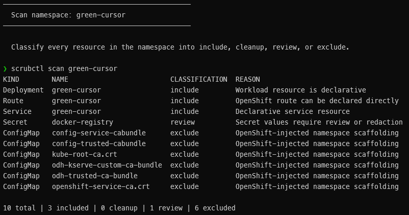

<p align="center">
  <a href="https://turbra.github.io/scrubctl/"></a>
</p>

<p align="center">
  <strong>Classify resources. Sanitize live manifests. Export GitOps-ready artifacts.</strong>
</p>

<p align="center">
  <a href="https://www.apache.org/licenses/LICENSE-2.0"></a>
</p>

<p align="center">
  <a href="https://turbra.github.io/scrubctl/">scrubctl</a> •
  <a href="#demo">Demo</a> •
  <a href="#install">Install</a> •
  <a href="#quick-start">Quick Start</a> •
  <a href="#documentation">Documentation</a> •
  <a href="#related">Related</a>
</p>

---

A standalone Go CLI that scrubs Kubernetes and OpenShift manifests, scans namespaces, and exports GitOps-ready artifacts. Use it from the terminal or automation pipelines for inline scrubbing and clean GitOps export workflows.

## Demo

[](https://turbra.github.io/scrubctl/#demo)

[Watch the terminal demo](https://turbra.github.io/scrubctl/#demo) on the project site to see `scrubctl` in action.

## Install

Build from source (requires Go 1.21+):

```sh
go build -o scrubctl ./cmd/scrubctl
sudo mv scrubctl /usr/local/bin/
scrubctl version
```

Or with `go install`:

```sh
go install github.com/turbra/scrubctl/cmd/scrubctl@latest
```

The binary lands in `$(go env GOBIN)` if set, otherwise `$(go env GOPATH)/bin` (typically `~/go/bin`). Make sure that directory is on your `PATH`.

### Install from a release archive

Download the archive matching your OS and architecture from the [GitHub Releases page](https://github.com/turbra/scrubctl/releases) (Linux, macOS, Windows — amd64 and arm64):

```sh
tar -xzf scrubctl-<version>-<os>-<arch>.tar.gz
sudo mv scrubctl /usr/local/bin/
scrubctl version
```

## Quick Start

```sh
# Scrub a single resource file — no cluster access needed
scrubctl scrub -f deployment.yaml

# Pipe a live resource through scrubctl
oc get deploy/web -n my-app -o yaml | scrubctl

# Scan a namespace and print the classification table
scrubctl scan my-app

# Export a namespace as a ZIP archive
scrubctl export my-app -o ./out

# Generate an Argo CD Application manifest
scrubctl generate argocd my-app \
  --repo-url https://github.com/example/repo.git \
  --revision main \
  --path manifests/overlays/install
```

When invoked with no subcommand and YAML on stdin, `scrubctl` scrubs the resource directly.

## Documentation

- [Command Reference](./docs/cli.md) — full command details, examples, and local development targets
- [Project Site](https://turbra.github.io/scrubctl/) — documentation home with install, quick start, and embedded demo

## Commands at a Glance

| Command | Description |
|---------|-------------|
| `scrub` | Scrub a single YAML resource from file or stdin |
| `scan` | Scan a namespace and print the classification table |
| `export` | Export a namespace scan as a ZIP archive |
| `generate argocd` | Generate an Argo CD Application manifest |
| `version` | Print the CLI version |
| `completion` | Generate shell autocompletion scripts |

### Global Flags

| Flag | Description |
|------|-------------|
| `--config` | Path to a config file for default flag values (see [docs](./docs/cli.md#config-file)) |
| `--kubeconfig` | Path to the kubeconfig file |
| `--context` | Kubeconfig context to use |
| `-n, --namespace` | Target namespace |
| `--secret-handling` | Secret handling mode: `redact`, `omit`, or `include` (default: `redact`) |
| `--include-kinds` | Comma-separated curated kinds to include |
| `--exclude-kinds` | Comma-separated curated kinds to exclude |
| `-q, --quiet` | Suppress non-essential output |
| `--log-level` | Log level (default: `info`) |

### Resource Scope

The `scan`, `export`, and `generate argocd` commands work with a **curated set** of namespaced resource kinds:

- **Kubernetes**: Deployment, StatefulSet, DaemonSet, Job, CronJob, Service, Secret, ConfigMap, PersistentVolumeClaim, NetworkPolicy, HorizontalPodAutoscaler, Ingress, Role, RoleBinding, ServiceAccount, LimitRange, PodDisruptionBudget, ResourceQuota
- **OpenShift**: Route, BuildConfig, ImageStream, ImageStreamTag

The `scrub` command and stdin pipe mode accept **any** Kubernetes kind — if you pipe it, scrubctl sanitizes it. Generic sanitization (metadata, status, annotations, finalizers) applies to every kind; kind-specific cleanup fires for known types like Deployment and Service.

## Related

`scrubctl` shares classification and sanitization logic with the [GitOps Export](https://github.com/turbra/gitops-export-plugin) OpenShift console plugin. Both tools produce identical output for the same input — verified by shared golden test fixtures.

## License

[Apache License 2.0](https://www.apache.org/licenses/LICENSE-2.0)
