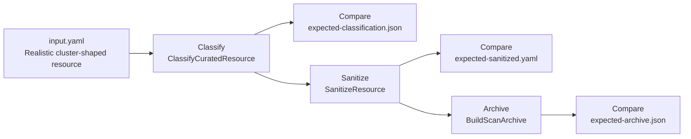
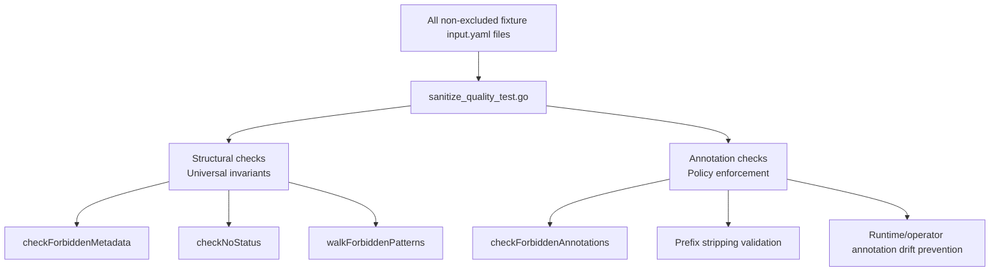
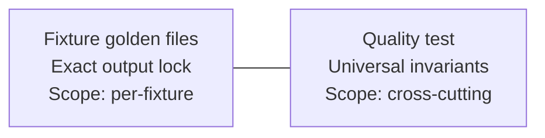

# Testing

Developer guide for scrubctl's test model. For command usage and installation, see <a href="{{ '/' | relative_url }}"><kbd>DOCS HOME</kbd></a> or <a href="{{ '/cli.html' | relative_url }}"><kbd>COMMAND REFERENCE</kbd></a>.

scrubctl uses fixture-based golden tests as its primary test strategy. The fixture files under `testdata/fixtures/` are test inputs and expected outputs only — they are not runtime data used by the scrubctl binary.

## Fixture directories

Each directory under `testdata/fixtures/` represents one resource scenario. There are currently 26 fixtures covering Deployments, StatefulSets, CronJobs, PVCs, Secrets, Services, Routes, and more.

Each fixture contains four files:

| File | Purpose |
|------|---------|
| `input.yaml` | A Kubernetes resource as it would appear from the cluster (with server-assigned fields, defaults, status, etc.) |
| `expected-classification.json` | The expected classification result: include, cleanup, review, or exclude, with the reason string |
| `expected-sanitized.yaml` | The expected sanitized resource after scrubctl strips defaults and server-assigned fields. `nil` for excluded resources. |
| `expected-archive.json` | The expected archive output structure (README, WARNINGS, manifest files) |

An optional `fixture.json` can override test defaults like `secretHandling`, `namespace`, or `scannedAt`.

## How fixture tests work

`TestFixturesMatchTSExpectations` in `internal/parity/parity_test.go` auto-discovers all fixture directories and runs each through the full pipeline:

Each comparison uses `go-cmp/cmp.Diff`. On failure, you get a unified diff showing exactly which fields differ between expected and actual output.

This validates that the classification, sanitization, and archive logic in the binary produces the expected output for each scenario. The fixture files themselves are inert test assets.

## Sanitization quality test

`TestSanitizationQuality` in `internal/sanitize/sanitize_quality_test.go` is a cross-cutting test that runs every non-excluded fixture input through sanitization and checks invariants that must hold for all output. It catches regressions that golden file comparison alone can miss — for example, a new fixture that accidentally includes `creationTimestamp: null` in both input and expected output.

Fixtures classified as `exclude` are skipped.

### Structural invariants

These are universal guarantees — every sanitized resource must satisfy them regardless of kind:

- **No server-assigned metadata:** `uid`, `resourceVersion`, `generation`, `creationTimestamp`, `managedFields`, `selfLink`, `ownerReferences`
- **No status field**
- **No nested `creationTimestamp: null`** anywhere in the object tree (catches `metadata.creationTimestamp` in embedded templates and volume claim templates)
- **No empty `securityContext: {}` or `affinity: {}` maps** (Kubernetes API defaults these to empty; they add noise to manifests)

### Annotation policy checks

The quality test also enforces that certain annotation prefixes never appear in sanitized output. Unlike structural invariants, these are policy decisions about which runtime/operator annotations should be stripped. The current enforced prefixes:

| Prefix | Why stripped |
|--------|-------------|
| `kubectl.kubernetes.io/last-applied-configuration` | Client-side apply bookkeeping |
| `pv.kubernetes.io/` | Volume provisioner runtime state |
| `volume.beta.kubernetes.io/` | Legacy volume annotations |
| `volume.kubernetes.io/` | Volume runtime annotations |
| `operator.openshift.io/` | OpenShift operator bookkeeping |
| `openshift.io/build.` | OpenShift build annotations |
| `imageregistry.operator.openshift.io/` | Image registry operator state |

The sanitizer (`shouldStripAnnotation` in `sanitize.go`) strips these same prefixes plus additional exact-match annotations (`deployment.kubernetes.io/revision`, `openshift.io/generated-by`, `openshift.io/host.generated`, `openshift.io/required-scc`) that are not yet enforced by the quality test. Adding a prefix to the quality test means every fixture must comply — do so only when the stripping rule is universal and intentional.

### Two layers of testing

The fixture golden files and the quality test serve different purposes:

A field can be stripped by the sanitizer without being enforced by the quality test. The golden file for that fixture still catches regressions. The quality test only needs to enforce invariants that are universal — things that should never appear in any sanitized output regardless of kind or context.

## When to add a new fixture

Add a fixture when:

- Adding sanitization support for a new resource kind
- A sanitization bug is discovered (capture the failing input as a regression test)
- A new classification or archive behavior needs to be locked in
- A real cluster resource exposes cleanup gaps not covered by existing fixtures

Name fixtures descriptively: `cronjob-cleanup`, `pvc-annotated`, `statefulset-vct`, `secret-omit`.

## Fixtures vs unit tests

**Fixtures** test realistic end-to-end scenarios: a full resource goes through classify, sanitize, and archive, and the output is compared to golden files. Use fixtures when you care about the combined behavior of the pipeline on a real-shaped resource.

**Unit tests** test focused behavior in a single function or code path. Use unit tests for edge cases in helper functions, boundary conditions, or logic that doesn't need a full resource to exercise.

Both run with `go test ./...`.

## Updating expected outputs

When scrubctl behavior intentionally changes (new fields stripped, classification reason updated, etc.):

1. Run `go test ./internal/parity/ -v` to see which fixtures fail and what the diff looks like.
2. Verify the diff represents a true improvement, not an accidental regression.
3. Update `expected-sanitized.yaml`, `expected-classification.json`, and `expected-archive.json` to match the new output.
4. Run `go test ./...` to confirm everything passes, including the quality test.

When adding new fixtures, prefer inputs derived from real cluster resources — they catch real-world cleanup gaps that synthetic inputs miss. Strip any sensitive values before committing.
